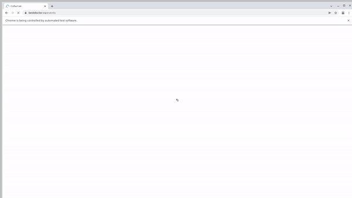

# Проект по тестированию главной страницы сайта "bestdoctor.ru"
> <a target="_blank" href="https://bestdoctor.ru/">bestdoctor.ru</a>


#### Список проверок, реализованных в UI-автотестах
- [x] Открытие главной страницы сайта
- [x] Вызов модального окна "Заполните форму для подключения компании"
- [x] Наличие требуемых заголовков в верхнем меню страницы
- [x] Переход по заголовку в меню
- [x] Наличие социальных сетей в подвале сайта и переход в одну из них
- [x] Вызов модального окна 'Получить материалы'
- [x] Получение доступа к вебинару
- [x] Негативная проверка при отправке незаполненной формы

## Проект реализован с использованием
Java Gradle IntelliJ IDEA Selenide Selenoid JUnit5 Jenkins Allure Report Allure TestOps Telegram Jira


## Для запуска автотестов в Jenkins
### 1. Открыть <a target="_blank" href="https://jenkins.autotests.cloud/job/qa_guru_python_12_homework_14/">проект</a>


### 2. Выбрать пункт **Собрать с параметрами**/**Build with Parameters**


### 3. В случае необходимости изменить параметры
- [x] Версия браузера по умолчанию 100, вручную можно внести другое значение (99.0, 120.0 или др.)
- [x] Значение окружения можно выбрать из выпадающего списка
- [x] Также можно изменить комментарий

### 4. Нажать **Собрать**/ **Build**


### 5. Результат запуска сборки можно посмотреть в отчёте Allure


## Локальный запуск автотестов
Пример командной строки:
> 1. Склонировать репозиторий
> 2. Открыть проект и установить интерпретатор
> 3. Создать файл с переменными окружения `.env` по образцу в корне проекта
> 4. Запустить тесты 

Пример командной строки:
```bash
pytest .
```

Получение отчёта:
```bash
allure serve build/allure-results
```
## Пример видеозаписи прохождения теста


## Настроено автоматическое оповещение о результатах сборки Jenkins в Telegram-бот

